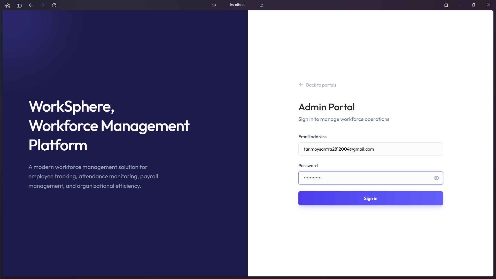
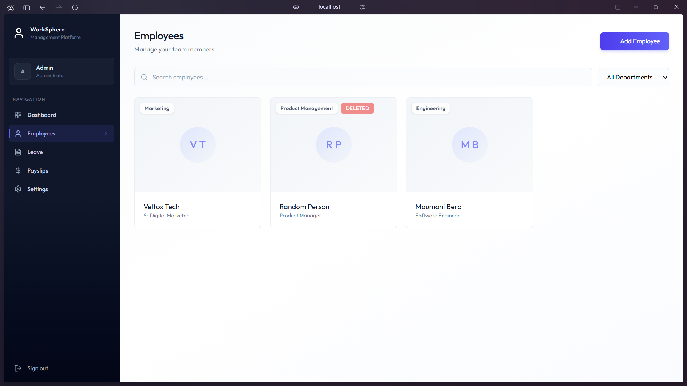
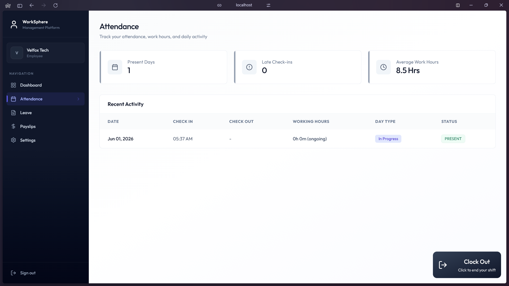
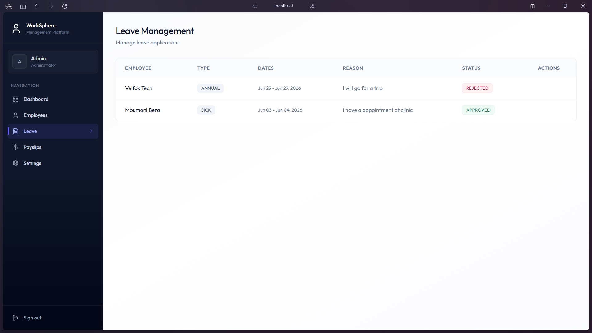
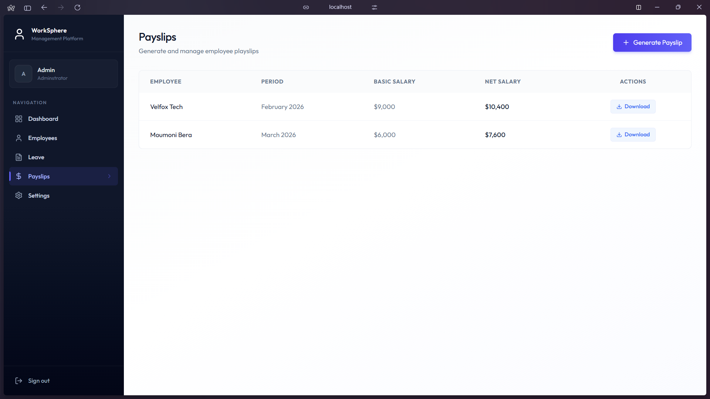
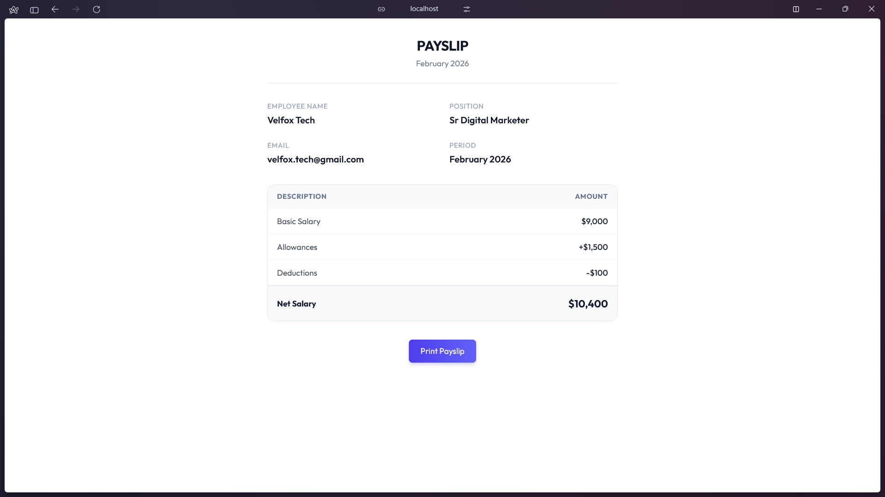

# WorkSphere

A full-stack Employee Management System built with React and Node.js, enabling organizations to manage employees, attendance, leave requests, and payroll through a role-based, centralized dashboard.

**Live Demo:**
[https://work-sphere-xi.vercel.app](https://work-sphere-xi.vercel.app)


---

## Table of Contents

- [Project Overview](#project-overview)
- [Live Demo](#live-demo)
- [Features](#features)
- [Technology Stack](#technology-stack)
- [System Architecture](#system-architecture)
- [Application Workflow](#application-workflow)
- [Project Structure](#project-structure)
- [Installation and Setup](#installation-and-setup)
- [Environment Variables](#environment-variables)
- [API Overview](#api-overview)
- [Database Models Overview](#database-models-overview)
- [Background Jobs and Automation](#background-jobs-and-automation)
- [Screenshots](#screenshots)
- [Security Considerations](#security-considerations)
- [License](#license)

---

## Project Overview

WorkSphere is a multi-role workforce management platform designed for small to mid-sized organizations. It provides a structured interface for administrators to manage the workforce lifecycle, from onboarding employees and tracking daily attendance to processing payroll and reviewing leave requests. Employees access a separate self-service portal to mark attendance, apply for leave, and view their payslips.

The backend exposes a RESTful API built with Express.js and MongoDB, protected with JWT-based authentication and role-based access control. Automated background workflows are handled by [Inngest](https://www.inngest.com/), covering scheduled reminders and time-delayed actions without requiring a separate job queue infrastructure.
                                                             | D

---

## Features

### Authentication and Authorization
- Separate login flows for Admin and Employee roles
- JWT-based session management with a 7-day token expiry
- Role-validated login: users cannot authenticate into the wrong role portal
- Password change functionality accessible from the Settings page

### Employee Management (Admin)
- Create employee records, simultaneously provisioning a linked user account
- Edit employee details including position, department, salary components, and bio
- Soft-delete employees: accounts are deactivated (`isDeleted: true`) rather than permanently removed, preserving historical records
- Filter employees by department
- Supports 10 predefined departments: Engineering, Human Resources, Marketing, Sales, Finance, Operations, IT Support, Customer Success, Product Management, and Design

### Attendance Tracking (Employee)
- Single-button clock-in and clock-out interface
- Late arrival detection: check-ins after 9:00 AM are flagged as `LATE`
- Automatic working hours calculation on clock-out
- Day type classification based on hours worked: Full Day (≥8h), Three Quarter Day (≥6h), Half Day (≥4h), Short Day (<4h)
- Per-employee attendance history with a configurable record limit

### Leave Management
- Employees can apply for Sick, Casual, or Annual leave
- Leave dates are validated to be strictly in the future, with end date after start date
- Admins see all leave applications and can filter by status (Pending, Approved, Rejected)
- Employees see only their own leave history along with their current profile context

### Payslip Generation (Admin)
- Admins generate payslips per employee per month/year
- Net salary is computed as: `basicSalary + allowances - deductions`
- Admins can view all payslips across the organization
- Employees can view only their own payslips
- Each payslip has a dedicated printable view accessible at `/print/payslips/:id`
- Access to individual payslips by ID is ownership-validated on the backend

### Dashboard Analytics
- **Admin dashboard** shows: total active employees, total departments, today's check-in count, and pending leave applications
- **Employee dashboard** shows: current month attendance count, pending leave count, and latest payslip net salary

### Profile Management
- Employees can view their profile (name, position, department, bio) and update their bio
- The sidebar dynamically loads and displays the logged-in user's name
- Deactivated employees are blocked from updating their profile

---

## Technology Stack

### Frontend
| Package | Purpose |
|---|---|
| React | UI framework |
| Vite | Build tool and dev server |
| Tailwind CSS | Utility-first styling |
| React Router DOM | Client-side routing |
| Axios | HTTP client with request interceptors |
| Lucide React | Icon library |
| React Hot Toast | Toast notifications |
| date-fns | Date formatting |

### Backend
| Package | Purpose |
|---|---|
| Node.js + Express | HTTP server and routing |
| MongoDB + Mongoose | Database and ODM |
| JSON Web Token | Stateless authentication |
| bcrypt | Password hashing |
| Multer | Multipart form data parsing |
| dotenv | Environment variable loading |
| Nodemailer | Email delivery |

### Automation and Email
| Service | Purpose |
|---|---|
| Inngest | Durable background jobs and scheduled cron functions |
| Brevo (SMTP) | Email relay for transactional notifications |

### Deployment
| Service | Purpose |
|---|---|
| Vercel | Frontend static hosting and backend serverless deployment |

---

## System Architecture

```
┌─────────────────────────────────────────────────────────┐
│                        CLIENT                           │
│   React + Vite (Vercel CDN)                            │
│                                                         │
│   ┌──────────┐  ┌────────────┐  ┌───────────────────┐  │
│   │AuthContext│  │ Axios      │  │  React Router     │  │
│   │(JWT state)│  │Interceptor │  │  (Protected routes│  │
│   └──────────┘  └────────────┘  └───────────────────┘  │
└───────────────────────┬─────────────────────────────────┘
                        │ HTTPS / Bearer Token
                        │
┌───────────────────────▼─────────────────────────────────┐
│                     SERVER (Vercel Serverless)           │
│   Express.js API                                         │
│                                                         │
│   ┌──────────────────────────────────────────────────┐  │
│   │             JWT Middleware (protect)              │  │
│   │          Role Guard (protectAdmin)                │  │
│   └──────────────────────────────────────────────────┘  │
│                                                         │
│   /api/auth  /api/employees  /api/attendance            │
│   /api/leave  /api/payslips  /api/dashboard             │
│   /api/profile  /api/inngest                            │
└───────────┬──────────────────────────┬──────────────────┘
            │                          │
     ┌──────▼──────┐            ┌──────▼──────────┐
     │   MongoDB   │            │    Inngest      │
     │  (Mongoose) │            │ (Background Jobs│
     │             │            │  + Cron)        │
     └─────────────┘            └────────┬────────┘
                                         │
                                  ┌──────▼──────┐
                                  │  Brevo SMTP │
                                  │  (Email)    │
                                  └─────────────┘
```

The frontend is a single-page application deployed as a static site on Vercel. All API calls are authenticated via a Bearer token attached by an Axios request interceptor. The backend runs as a Node.js serverless function on Vercel with all routes handled through a single Express app entry point. Inngest is integrated as an Express route (`/api/inngest`) and communicates with the server via webhook-style event delivery.

---

## Application Workflow

### Login Flow
1. User selects Admin or Employee portal from the landing page
2. Credentials are submitted to `POST /api/auth/login` with a `role_type` field
3. The backend verifies the password with bcrypt and confirms the user's role matches the requested portal
4. A signed JWT (7-day expiry) is returned and stored in `localStorage`
5. Subsequent requests attach the token via the Axios interceptor; the `protect` middleware validates it on every protected route

### Attendance Flow
1. Employee clicks "Clock In", triggers `POST /api/attendance`
2. Backend creates an Attendance record with `checkIn` timestamp; marks status as `LATE` if after 9:00 AM
3. An Inngest event (`employee/check-out`) is dispatched, scheduling an auto-checkout check 9 hours later
4. Employee clicks "Clock Out", same endpoint computes working hours and assigns a day type
5. If the employee has not clocked out after 9 hours, a reminder email is sent; after 10 hours, the record is auto-closed with `workingHours: 10` and `dayType: "Full Day"`

### Leave Application Flow
1. Employee submits a leave application via the Apply Leave modal
2. Backend validates dates (future-only, end ≥ start) and creates a `LeaveApplication` with status `PENDING`
3. An Inngest event (`leave/pending`) is dispatched, scheduling a 24-hour check
4. If the admin has not acted on the application within 24 hours, an automated reminder email is sent to the admin's configured email address
5. Admin approves or rejects via `PATCH /api/leave/:id`; the leave status is updated accordingly

### Payslip Flow
1. Admin generates a payslip for a specific employee, month, and year via the payslip form
2. Net salary is computed server-side and the Payslip document is persisted
3. Admins can list all payslips; employees see only their own
4. The printable payslip page at `/print/payslips/:id` fetches the full record (with employee details populated) and renders a print-optimized layout; ownership is enforced before returning data

### Daily Attendance Cron (11:30 AM IST)
1. Inngest fires the `attendance-reminder-cron` function at 11:30 AM IST every day
2. All active, non-deleted employees are fetched
3. Employees on approved leave for that day are excluded
4. Employees who have already checked in are excluded
5. Reminder emails are sent in parallel to the remaining absent employees

---

## Project Structure

```
WorkSphere-main/
├── client/                          # React frontend
│   ├── public/
│   ├── src/
│   │   ├── api/
│   │   │   └── axios.js             # Axios instance with auth interceptor
│   │   ├── assets/
│   │   │   ├── assets.jsx           # Static asset references
│   │   │   └── email-template.js    # (Unused in production)
│   │   ├── components/
│   │   │   ├── AdminDashboard.jsx   # Admin stats overview
│   │   │   ├── ChangePasswordModal.jsx
│   │   │   ├── EmployeeCard.jsx
│   │   │   ├── EmployeeDashboard.jsx # Employee stats overview
│   │   │   ├── EmployeeForm.jsx     # Create/Edit employee form
│   │   │   ├── Loading.jsx
│   │   │   ├── LoginForm.jsx
│   │   │   ├── LoginLeftSide.jsx
│   │   │   ├── ProfileForm.jsx
│   │   │   ├── Sidebar.jsx          # Role-aware navigation
│   │   │   ├── attendance/
│   │   │   │   ├── AttendanceHistory.jsx
│   │   │   │   ├── AttendanceStats.jsx
│   │   │   │   └── CheckInButton.jsx
│   │   │   ├── leave/
│   │   │   │   ├── ApplyLeaveModal.jsx
│   │   │   │   └── LeaveHistory.jsx
│   │   │   └── payslip/
│   │   │       ├── GeneratePayslipForm.jsx
│   │   │       └── PayslipList.jsx
│   │   ├── context/
│   │   │   └── AuthContext.jsx      # Auth state, login/logout, session refresh
│   │   ├── pages/
│   │   │   ├── Attendance.jsx
│   │   │   ├── DashBoard.jsx        # Role-based dashboard routing
│   │   │   ├── Employees.jsx        # Admin-only employee management
│   │   │   ├── Layout.jsx           # Protected layout wrapper
│   │   │   ├── Leave.jsx
│   │   │   ├── LoginLanding.jsx     # Portal selection
│   │   │   ├── Payslips.jsx
│   │   │   ├── PrintPlayslip.jsx    # Print-optimized payslip view
│   │   │   └── Settings.jsx
│   │   ├── App.jsx                  # Route definitions
│   │   └── main.jsx
│   ├── index.html
│   ├── vite.config.js
│   └── vercel.json                  # SPA rewrite rules
│
└── server/                          # Express backend
    ├── config/
    │   ├── db.js                    # MongoDB connection
    │   └── nodemailer.js            # Brevo SMTP transporter
    ├── constants/
    │   └── departments.js           # Departments enum
    ├── controllers/
    │   ├── attendanceController.js
    │   ├── authController.js
    │   ├── dashboardController.js
    │   ├── employeeController.js
    │   ├── leaveController.js
    │   ├── payslipController.js
    │   └── profileController.js
    ├── inngest/
    │   └── index.js                 # Background functions and cron jobs
    ├── middleware/
    │   └── auth.js                  # JWT protect + protectAdmin guards
    ├── models/
    │   ├── Attendance.js
    │   ├── Employee.js
    │   ├── LeaveApplication.js
    │   ├── Payslip.js
    │   └── User.js
    ├── routes/
    │   ├── attendanceRoutes.js
    │   ├── authRoutes.js
    │   ├── dashboardRoutes.js
    │   ├── employeeRoutes.js
    │   ├── leaveRoutes.js
    │   ├── payslipsRoutes.js
    │   └── profileRoutes.js
    ├── seed.js                      # Admin account provisioning script
    ├── server.js                    # App entry point
    └── vercel.json                  # Serverless routing config
```

---

## Installation and Setup

### Prerequisites
- Node.js 18+
- A MongoDB instance (local or MongoDB Atlas)
- An [Inngest](https://www.inngest.com/) account (free tier is sufficient)
- A [Brevo](https://www.brevo.com/) account for SMTP email relay

### 1. Clone the Repository

```bash
git clone https://github.com/your-username/WorkSphere.git
cd WorkSphere
```

### 2. Backend Setup

```bash
cd server
npm install
```

Create a `.env` file in the `server/` directory (see [Environment Variables](#environment-variables) below), then seed the admin account:

```bash
npm run seed
```

Start the development server:

```bash
npm run server
```

The API will be available at `http://localhost:4000`.

### 3. Frontend Setup

```bash
cd ../client
npm install
```

Create a `.env` file in the `client/` directory:

```env
VITE_BASE_URL=http://localhost:4000
```

Start the development server:

```bash
npm run dev
```

The application will be available at `http://localhost:5173`.

### 4. Inngest Dev Server (for background jobs)

With the backend running, start the Inngest dev server in a separate terminal:

```bash
npx inngest-cli@latest dev -u http://localhost:4000/api/inngest
```

This connects Inngest's local event relay to your running server so background functions fire during development.

---

## Environment Variables

### Server (`server/.env`)

| Variable | Description | Example |
|---|---|---|
| `PORT` | Port for the Express server | `4000` |
| `MONGODB_URI` | MongoDB connection string | mongoDB URI |
| `JWT_SECRET` | Secret key for signing JWTs | A long, random string |
| `ADMIN_EMAIL` | Email address for the admin account (used by seed script and leave reminders) | `admin@yourcompany.com` |
| `SMTP_USER` | Brevo SMTP username | Provided by Brevo |
| `SMTP_PASS` | Brevo SMTP password / API key | Provided by Brevo |
| `SENDER_EMAIL` | From address for outgoing emails | `noreply@yourcompany.com` |
| `INNGEST_SIGNING_KEY` | Inngest signing key (required in production) | Provided by Inngest dashboard |
| `INNGEST_EVENT_KEY` | Inngest event key | Provided by Inngest dashboard |

### Client (`client/.env`)

| Variable | Description | Example |
|---|---|---|
| `VITE_BASE_URL` | Base URL for the backend API | `http://localhost:4000` |

---

## API Overview

All protected routes require an `Authorization: Bearer <token>` header. Routes marked **Admin only** additionally require the authenticated user to have `role: "ADMIN"`.

### Authentication

| Method | Endpoint | Auth | Description |
|---|---|---|---|
| `POST` | `/api/auth/login` | None | Authenticate and receive a JWT |
| `GET` | `/api/auth/session` | Required | Validate token and return session payload |
| `POST` | `/api/auth/change-password` | Required | Update the authenticated user's password |

### Employees

| Method | Endpoint | Auth | Description |
|---|---|---|---|
| `GET` | `/api/employees` | Admin only | List all employees; supports `?department=` filter |
| `POST` | `/api/employees` | Admin only | Create an employee and linked user account |
| `PUT` | `/api/employees/:id` | Admin only | Update an employee record |
| `DELETE` | `/api/employees/:id` | Admin only | Soft-delete an employee (sets `isDeleted: true`) |

### Attendance

| Method | Endpoint | Auth | Description |
|---|---|---|---|
| `POST` | `/api/attendance` | Required | Clock in or clock out (determined by existing record state) |
| `GET` | `/api/attendance` | Required | Retrieve the authenticated employee's attendance history |

### Leave

| Method | Endpoint | Auth | Description |
|---|---|---|---|
| `POST` | `/api/leave` | Required | Submit a new leave application |
| `GET` | `/api/leave` | Required | List leave applications (all for Admin; own for Employee) |
| `PATCH` | `/api/leave/:id` | Admin only | Update leave application status (Approved / Rejected) |

### Payslips

| Method | Endpoint | Auth | Description |
|---|---|---|---|
| `POST` | `/api/payslips` | Admin only | Generate a payslip for an employee |
| `GET` | `/api/payslips` | Required | List payslips (all for Admin; own for Employee) |
| `GET` | `/api/payslips/:id` | Required | Retrieve a single payslip (ownership-validated for Employees) |

### Dashboard

| Method | Endpoint | Auth | Description |
|---|---|---|---|
| `GET` | `/api/dashboard` | Required | Returns role-specific summary metrics |

### Profile

| Method | Endpoint | Auth | Description |
|---|---|---|---|
| `GET` | `/api/profile` | Required | Retrieve the authenticated user's profile |
| `POST` | `/api/profile` | Required | Update bio (Employee only; blocked for deactivated accounts) |

### Inngest

| Method | Endpoint | Description |
|---|---|---|
| `GET/POST/PUT` | `/api/inngest` | Inngest webhook handler (managed by the Inngest SDK) |

---

## Database Models Overview

### `User`
Handles authentication credentials, separate from employee profile data.

| Field | Type | Notes |
|---|---|---|
| `email` | String | Unique |
| `password` | String | bcrypt-hashed |
| `role` | String | `ADMIN` or `EMPLOYEE` |

### `Employee`
Stores all workforce profile and compensation data, linked to a `User` via `userId`.

| Field | Type | Notes |
|---|---|---|
| `userId` | ObjectId | Ref: `User`, unique |
| `firstName`, `lastName` | String | |
| `email` | String | |
| `phone` | String | |
| `position` | String | |
| `department` | String | Enum of 10 departments |
| `basicSalary`, `allowances`, `deductions` | Number | Used for payslip generation |
| `employeeStatus` | String | `ACTIVE` or `INACTIVE` |
| `joinDate` | Date | |
| `isDeleted` | Boolean | Soft-delete flag |
| `bio` | String | Employee-editable |

### `Attendance`
One record per employee per calendar day. Indexed on `(employeeId, date)` with a unique constraint.

| Field | Type | Notes |
|---|---|---|
| `employeeId` | ObjectId | Ref: `Employee` |
| `date` | Date | Midnight-normalized |
| `checkIn`, `checkOut` | Date | Nullable until action taken |
| `status` | String | `PRESENT`, `ABSENT`, or `LATE` |
| `workingHours` | Number | Computed on checkout |
| `dayType` | String | `Full Day`, `Three Quarter Day`, `Half Day`, `Short Day` |

### `LeaveApplication`

| Field | Type | Notes |
|---|---|---|
| `employeeId` | ObjectId | Ref: `Employee` |
| `type` | String | `SICK`, `CASUAL`, or `ANNUAL` |
| `startDate`, `endDate` | Date | |
| `reason` | String | |
| `status` | String | `PENDING`, `APPROVED`, or `REJECTED` |

### `Payslip`

| Field | Type | Notes |
|---|---|---|
| `employeeId` | ObjectId | Ref: `Employee` |
| `month`, `year` | Number | Payroll period |
| `basicSalary`, `allowances`, `deductions` | Number | Snapshot at generation time |
| `netSalary` | Number | `basicSalary + allowances - deductions` |

---

## Background Jobs and Automation

WorkSphere uses Inngest for three durable background workflows. These are registered under the Inngest app ID `WorkSphere-WMP` and served via the Express route `/api/inngest`.

### 1. Auto Check-Out (`auto-check-out`)

**Trigger:** `employee/check-out` event, dispatched on every clock-in.

**Behavior:**
- Waits 9 hours from the time the event was dispatched
- Checks whether the employee has clocked out
- If not: sends a reminder email to the employee
- Waits an additional 1 hour (10 hours total from check-in)
- If still not clocked out: auto-closes the record with `checkOut = checkIn + 10h`, `workingHours: 10`, `dayType: "Full Day"`, `status: "LATE"`

This prevents open attendance records caused by employees forgetting to clock out.

### 2. Leave Approval Reminder (`leave-application-reminder`)

**Trigger:** `leave/pending` event, dispatched on every new leave application.

**Behavior:**
- Waits 24 hours
- Checks whether the leave application is still in `PENDING` status
- If still pending: sends a reminder email to the configured `ADMIN_EMAIL` with the application details

### 3. Daily Attendance Reminder Cron (`attendance-reminder-cron`)

**Trigger:** Cron schedule — `TZ=Asia/Kolkata 30 11 * * *` (11:30 AM IST daily).

**Behavior (multi-step):**
1. Computes the current day's UTC date range in IST
2. Fetches all active, non-deleted employees
3. Fetches all employees on approved leave that day
4. Fetches all employees who have already checked in
5. Derives the absent set by exclusion
6. Sends reminder emails to all absent employees in parallel

The cron uses Inngest's `step.run` to checkpoint each phase, making the workflow resumable if any step fails.

---

## Screenshots

> Replace the placeholders below with actual screenshots of the running application.

<p align="center">
    <b>Admin Dashboard</b><br><br>
  
</p>

<table align="center">
  <tr>
    <td align="center">
      <b>Login Page</b><br><br>
      
    </td>
    <td align="center">
      <b>Employee Management</b><br><br>
      
    </td>
  </tr>
</table>

<table align="center">
  <tr>
    <td align="center">
      <b>Attendance Page (Employee View)</b><br><br>
      
    </td>
    <td align="center">
      <b>Leave Management</b><br><br>
      
    </td>
  </tr>
</table>

<table align="center">
  <tr>
    <td align="center">
      <b>Payslip List</b><br><br>
      
    </td>
    <td align="center">
      <b>Printable Payslip</b><br><br>
      
    </td>
  </tr>
</table>

---

## Security Considerations

**Authentication:** All protected routes require a valid JWT verified against `JWT_SECRET`. Tokens carry the user's `userId`, `role`, and `email` as claims and expire after 7 days.

**Role enforcement:** Two middleware functions guard routes — `protect` validates the JWT and attaches the session, while `protectAdmin` checks that `session.role === "ADMIN"`. Admin-only operations (employee CRUD, payslip creation, leave status updates) cannot be reached by authenticated employees.

**Payslip access control:** The `GET /api/payslips/:id` endpoint performs an additional ownership check for non-admin users, returning `403 Forbidden` if the payslip does not belong to the requesting employee. This prevents horizontal privilege escalation via ID enumeration.

**Soft deletion:** Deleting an employee sets `isDeleted: true` rather than removing the document. Deactivated accounts cannot clock in, apply for leave, or update their profile. Historical records remain intact.

**Password storage:** Passwords are hashed with bcrypt (salt rounds: 10) before storage. Plaintext passwords are never persisted or logged.

**CORS:** The Express server uses the `cors` package. For production deployments, the CORS configuration should be restricted to the known frontend origin.

**Environment isolation:** All secrets (JWT secret, database URI, SMTP credentials, Inngest keys) are loaded from environment variables via `dotenv` and are never committed to the repository.

---

## Author

Tanmoy Santra

Final Year B.Tech Computer Science & Engineering Student

GitHub: https://github.com/TanmoySantra28

LinkedIn: https://linkedin.com/in/tanmoysantra28